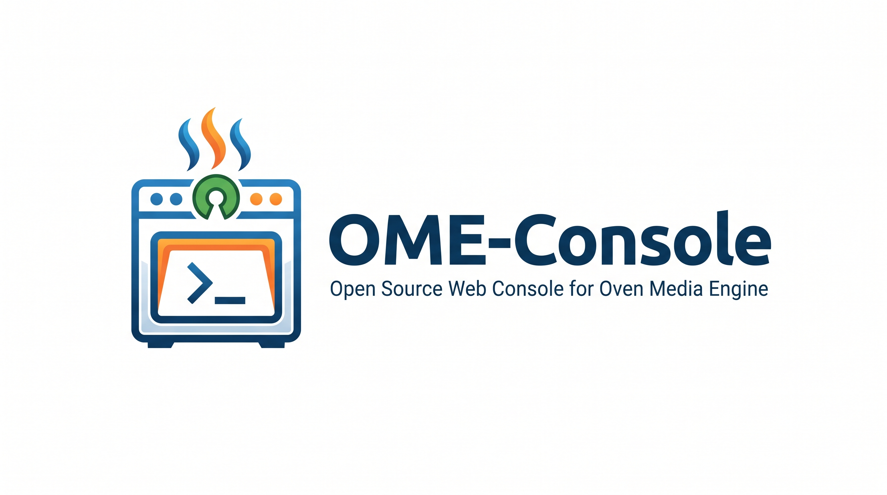
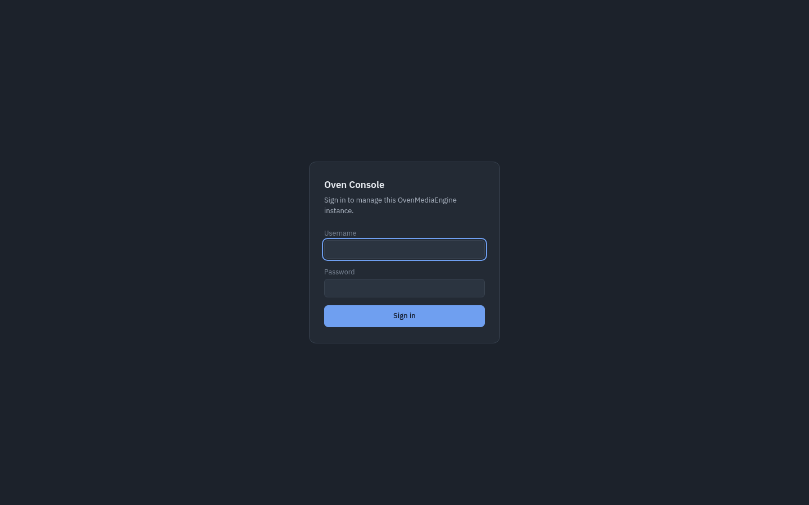
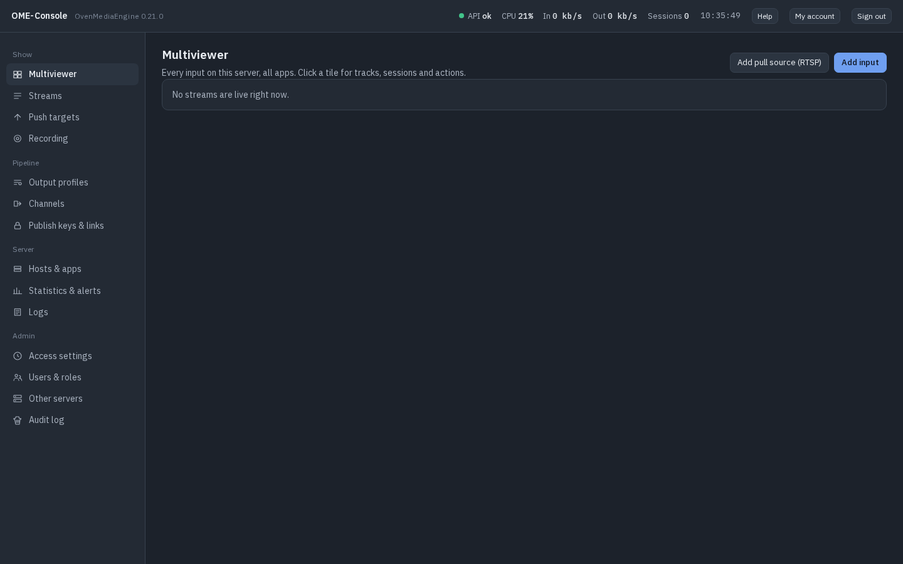
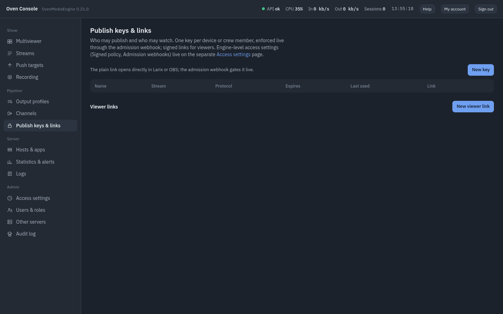
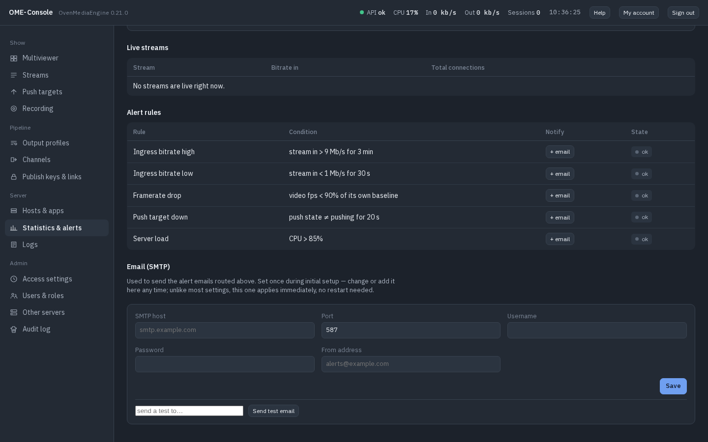

# ome-console

[](LICENSE)

## About

ome-console is an independent web console for
[OvenMediaEngine](https://github.com/OvenMediaLabs/OvenMediaEngine) (OME).
It talks to OME through its public REST API and does not modify OME. The
optional combined stack pulls the official OME image from Docker Hub.

ome-console is not affiliated with, endorsed by, or supported by
OvenMedia Labs Inc. "OvenMediaEngine" and "OME" are their trademarks and are
used here only to indicate compatibility.

## License

ome-console is **source-available** under the
[Elastic License 2.0](LICENSE).

**You can:**
- run it on your own servers, at no cost, for personal or commercial use
- use it on paid projects and client work (events, productions, installations)
- modify it, fork it, and share your changes
- run it internally for your own team or organisation

**You cannot:**
- offer ome-console itself to third parties as a hosted or managed service
  (e.g. "log in and manage your streams" for your customers)
- remove or hide the license notices

If your use case falls in the grey zone, open an issue or email
info@videopro.io — the answer is usually yes. A commercial license is
available for hosting providers.

Contributions are accepted under a Contributor License Agreement
(see [CONTRIBUTING.md](CONTRIBUTING.md)).

## Screenshots

| Sign in | Multiviewer |
| --- | --- |
|  |  |

| Publish keys & viewer links | Email (SMTP) settings |
| --- | --- |
|  |  |

## What it does

- **Multiviewer** — every live input across the server, at a glance, with per-tile tracks/sessions/actions.
- **Streams, push & record** — pull/push RTMP/SRT/RTSP/WebRTC sources, push to RTMP/SRT/MPEG-TS destinations, schedule recordings, all with reusable presets.
- **Publish keys & viewer links** — gate who can publish (enforced live via an admission webhook) and issue expiring, signed playback links, without touching OME's config by hand.
- **Multi-user roles** — Viewer / Operator / Engineer, additive permissions, a real `users` table with bcrypt-hashed passwords.
- **Alerts** — a fixed rule catalog evaluated against the same live stats feed the UI uses, routed to email, with SMTP configurable right in the app (Engineer settings, on the Statistics & alerts page) — set it up during the initial wizard or any time after.
- **Audit log** — every console-initiated write, attributed to the user who made it.
- **Multi-server registry** — register other OME instances for a reachability check (operational multi-server switching is intentionally out of scope for now).

## Deployment

### Two ways to run this

- **Console-only (default).** Nothing in this repo starts an OvenMediaEngine instance for you — bring your own already-running OME and point the console at it. You'll need to copy this repo's `ome/conf/Server.xml` `<Managers><API><AccessToken>` (and, for AdmissionWebhooks/SignedPolicy/alerting to work, its `<AdmissionWebhooks>`/`<SignedPolicy>` `<SecretKey>` values too) into your own OME's config — the console can't manage an instance that doesn't have this wiring.
- **Combined stack (optional).** Set `COMPOSE_PROFILES=with-ome` in `.env` and `docker compose up -d` also starts a bundled, pre-wired `ome` service straight from this repo — no manual config-porting needed. Recommended if you don't already run OvenMediaEngine.

Both modes share the same setup wizard, prerequisites, and update/backup steps below.

### Prerequisites

- Docker and Docker Compose.
- A reverse proxy in front of the console for real TLS (any of Nginx Proxy Manager, Caddy, Traefik — this repo's `docker-compose.yml` assumes one exists but doesn't include one). Combined-stack mode fronts OME too.
- A Docker network your reverse proxy and this stack both join, literally named `proxy`:
  ```bash
  docker network create proxy
  ```
  Skip this if that network already exists. Without it, `docker compose up -d` fails immediately with "network proxy declared as external, but could not be found".

### First install

**Console-only** (bring your own OME — see above for the config it needs):

```bash
git clone https://github.com/JuthX/ome-console.git
cd ome-console
cp .env.example .env
# edit .env: OME_API_BASE_URL, OME_MEDIA_BASE_URL, OME_ACCESS_TOKEN
docker compose up -d
```

**Combined stack** (also start the bundled OME):

```bash
git clone https://github.com/JuthX/ome-console.git
cd ome-console
cp .env.example .env
# edit .env: uncomment COMPOSE_PROFILES=with-ome, set OME_HOST_IP
docker compose up -d
```

Either way, then visit `https://<your-console-domain>/setup` (or `http://localhost:3000/setup` for local testing) — a one-time wizard walks you through:

1. Creating your first (Engineer) account.
2. Connecting to your OvenMediaEngine instance — host IP/domain is optional (leave it blank for local-only testing; set it for real before going live, since WebRTC playback needs it for viewers off this host), and you can either paste an access token or let the wizard generate one.
3. Naming your vhost/app (defaults match OME's own `default`/`app`).
4. Generating the session-signing and access-control secrets the console needs — strong, random, never hand-typed.
5. Optionally configuring SMTP for alert emails (skippable — there's also a real settings page for this later, under Statistics & alerts).
6. Restarting the stack (`docker compose up -d` — the wizard shows you the exact command) so the new configuration takes effect, then confirming it's live.

After that, sign in at `/login` with the account you created.

**Already have real users?** Set `CONSOLE_ADMIN_USER`/`CONSOLE_ADMIN_PASSWORD_HASH` in `.env` instead — the wizard is skipped entirely and that becomes the first Engineer account.

### Updating

```bash
git pull
docker compose build console
docker compose up -d
```

In combined-stack mode, `ome` only needs rebuilding/restarting if you changed `ome/conf/Server.xml` or `.env` values it reads — the console picks up code changes on every `docker compose build console`.

### Backups

See [BACKUP.md](BACKUP.md) for the backup script and restore procedure.

## Architecture

- `ome/` — OvenMediaEngine's own config (`conf/Server.xml`, `conf/Logger.xml`), mounted read-only into the `ome` container.
- `console/` — the Next.js 16 app (App Router, TypeScript) that is this whole project's UI and API.
- `docker-compose.yml` / `.env` — the console, plus an optional bundled OME (see "Two ways to run this" under Deployment).

The two containers are named `ome` and `console` — generic names that could collide if another stack on the same host already uses them. Rename them in `docker-compose.yml`'s `container_name:` fields if that happens; `docker compose up -d` will otherwise fail with a clear "container name already in use" error, not something silent.

A few decisions worth knowing before you dig into the code:

- **The console is a secondary source of state, not the primary one.** Anything declared in `Server.xml` is read-only via OME's API — the console never pretends it can edit what it can't. Console-created resources (push/record tasks, publish keys, alert routes) live in the console's own SQLite database, and a reconciler re-applies them to OME after a restart, since OME itself doesn't persist API-created resources.
- **Server-side-only OME access.** Every OME REST call goes through one client module, imported only from server code — the API access token never reaches the browser.
- **One background poller, not per-page polling.** A single process hits OME's stats API every few seconds and fans a snapshot out over Server-Sent Events to every open tab.
- **Console-owned state lives in SQLite**, bind-mounted so it survives rebuilds. The schema is additive-only — nothing here does destructive migrations.

## Contributing

See [CONTRIBUTING.md](CONTRIBUTING.md) for the Contributor License Agreement, local dev setup, the test suite (`npm test`, Vitest), and PR expectations. Found a security issue? See [SECURITY.md](SECURITY.md) instead of opening a public issue.
